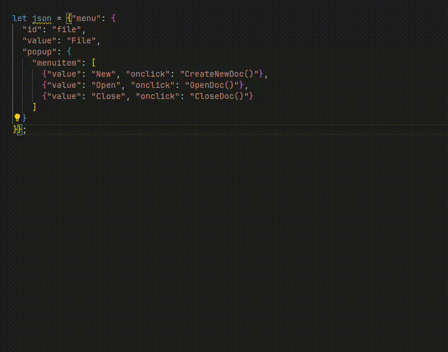

# Wider

Wider has been implemented to support a novel JavaScript on type formatting approach featuring an expanded layout aimed at enhancing readability. Specifically tailored for JavaScript coders who prefer:

- Utilizing ternaries and short circuits for conditional evaluations instead of employing traditional constructs such as `if-then-else` or `switch-case`.
- Opting for arrow functions over classical function declarations.
- Employing parentheses and the comma operator in lieu of curly braces.
- Adopting a comma-first object / array layout.
- Opting for chaining promises over async-await.
- Employing deep indentation for classical functions.

It is acknowledged that some coders may initially find the wider code formatting style unfamiliar, and a few may encounter challenges in grasping its rationale. Nevertheless, embracing this formatting approach will reveal its convenience, leading to potential enjoyment. Additionally, it is worth noting that the optimal viewing experience for wider JavaScript code is attained with the aid of an ultrawide monitor and the [Wide Github](https://chromewebstore.google.com/detail/wide-github/kaalofacklcidaampbokdplbklpeldpj?pli=1) Chrome/Firefox browser extension. This combination ensures that the resulting code is displayed in the most suitable fashion.

The initial release of Wider aims to fulfill the basic requirements set forth by the project's creator. However, in addition to maintenance, future releases will be implemented as the need for new functionalities arises.  Please feel free to request additional features that you think would complement the package effectively.

## Features

The features introduced in this package can individually be enabled / disabled through Wider's settings menu. The current functionalities of Wider are as follows;

- ### Simple Ternary

**Simple Ternary** is the one that we know best. Entering colon (`:`) moves it to the last question mark's (`?`) indent on the next line.

- ### Nested Ternary

**Nested Ternary** is about narowing multiple but dependent conditions into a single resolution. Such as in pseudo code  `if x === 1 and y === 0 then doSomeThingA()` but `if x === 1 and y !== 0 then doSomeThingB()` however `if !== 1 then doSomethingC()` and assign the result to `a`. Entering colon (`:`) moves it to the last unmatched question mark's (`?`) indent on the next line.

- ### Switching Ternary

**Switching Ternary** is similar to the `Switch - Case` abstraction but much more powerful because we are not limited to switching between the results of a single test. It's about resolving multiple but independent conditions. For example, in pseudocode, `if x === 1 then doSomethingA()`, `if y === 0 then doSomethingB()`, `if z === 2 then doSomethingC()` and assign the result to `a`. Entering colon (`:`) moves it to the last unmatched question mark's (`?`) indent on the next line.

- ### Comma First Objects

**Even if the comma-first functionality is enabled from the settings, it will only be effective if a space is placed after the left curly brace, left paranthesis or square bracket**. Wider then auto-adopts a comma-first layout for object/array structures when a comma is entered at the end of the line. It's important to know that the **Auto Closing Brackets** option of the VSCode editor should be active, and you should be typing between the brackets. Also, when activated, Wider will attempt to set the **Auto Closing Brackets** option to `"always"`. This functionality is also available for `.json` files; however, it comes disabled by default, and you have to enable it from the Wider settings if you are working on a file like `package.json`, etc.

- ### Comma First Expression Sequencing / Arguments

When the [comma operator (,)](https://developer.mozilla.org/en-US/docs/Web/JavaScript/Reference/Operators/Comma_operator) is used for sequencing expressions or to separate function arguments. The comma-first layout scheme enhances the readability of the code especially with ternary based conditionals or with stacked method chains. In function arguments you may still benefit from this functionality if your arguments are long or expressions by themselves.

If a space is placed right after the opening left bracket, Wider automatically adopts the comma-first layout mode for expression sequencing. This takes effect when a comma is added at the end of the line. It's important to note that the **Auto Closing Brackets** option of the VSCode editor should be active and you should be typing between the brackets. Also note that when activated, Wider will attempt to set the **Auto Closing Brackets** option in the VSCode editor settings to `"always"`.

- ### Selection to Comma First

Starting with version 0.2.0, an experimental feature has been incorporated with the purpose of transforming a selected object or array structure into a broader comma-first layout. It is recommended that the selection closely encompasses the object or array intended for conversion. Should the selection extend to extraneous portions of your code, the algorithm's eagerness for conversion may result in unintended alterations. Also as of current version all comments in the selection are removed. This is a backlog and will be fixed.

Prior to implementation, testing and cautious usage is advised to avoid unexpected changes in your codebase.

- ### Stacked Method Chaining

Wider demonstrates a high proficiency in stacked method chaining, especially in contexts similar to JavaScript (JS) Promises, particularly when used in conjunction with **Comma First Expression Sequencing**. In the domain of Promises and other concepts centered around method chaining, the imperative nature of stacked method chaining becomes pivotal. It's important to note that Wider's functionality for **stacked method chaining** doesn't stack properties and is only effective when methods are immediately followed by a period.

- ### Deep Indented Functions

Wherever a classical function declaration is on the line, its body gets indented 2 spaces relative to the start of the "function" keyword. This method of indentation isolates the function clearly from the rest of the code, avoiding the need to search for closing curly brackets. The usefulness of **Deep Indented Functions** is particularly evident when classically defined functions are used as callbacks or within **Comma-First Expression Sequencing**.

## Requirements

Wider has no dependencies.

## Extension Settings

By default, the aforementioned features are enabled, but you have the flexibility to disable them individually through the settings menu, and the changes will take effect immediately.

* `wider.commaFirstLayout`: Enable/disable comma-first style for objects alongside paranthesised comma-first style for expression sequencing / arguments.
* `wider.deepIndentedFunctions`: Enable/disable deep indentation for classical functions.
* `wider.stackedMethodChaining`: Enable/disable stacked method chaining.
* `wider.ternaryFormatting`: Enable/disable ternary formatting.

## Known Issues

Nothing so far. Feel free to register encountered [issues](https://github.com/kedicesur/wider/issues) at the project repo.

## Things to Remember

* If you have enabled the "comma-first" at the settings, leave a space after `{ `, `[ ` or `( ` to make the comma-first functionality effective. This way even if it's activated in the settings, you still have the flexibility to enable / disable it for the individual object that you are typing.
* Starting from v0.2.5, the comma-first feature now includes an built in **Declarations Alignment** functionality. When declaring or assigning multiple variables after `let` or `var` keywords, separated by commas, Wider automatically aligns all `=` assignment operators within that group based on the length of the longest variable name.
* Regexes are important. When you are typing a regex you best start typing inbetween two forward slashes.

  `/-> type here/`
     
  This way the special characters being typed in the Regex such as `,`, `]` or `(` etc. are not considered as delimiters and do not trigger a fake indent involuntarily.

## Release Notes

See the [CHANGELOG](CHANGELOG.md) file for details.

## License

This project is licensed under the MIT License - see the [LICENSE](LICENSE) file for details.
